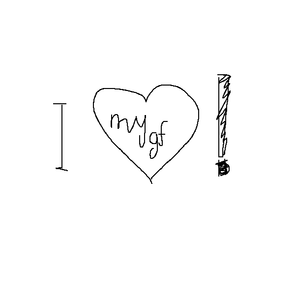

# turtly-draw
## Introduction
A simple drawing tool made with Python built-in `turtle` module. The greatest way to show the possibillities of Python built-in graphic tools.

### Capabilities
- Press `s` to save `.png` image into directory of the project



## Requirements
- **Tk** interface package (**Tkinter**)
- **PIL** image manager (**Pillow**)
```bash
pip install -r requirements.txt
```
## Installation
```bash
git clone https://illmilo/turtly-draw.git
cd turtly-draw
```
## Contribuition
Feel free to fork this repository and contribute! You might implement additional features to make this little application bigger and more functional.
## License
Licensed under [MIT License](LICENSE).